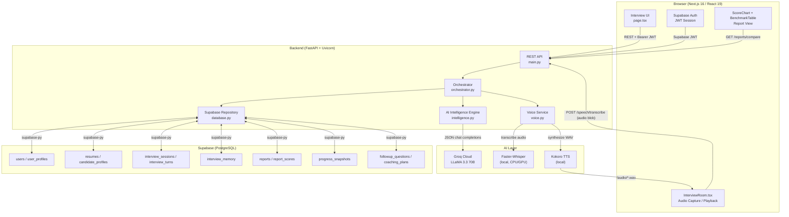
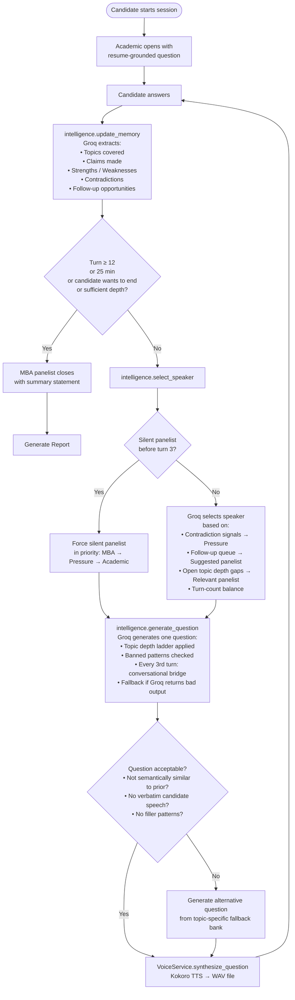
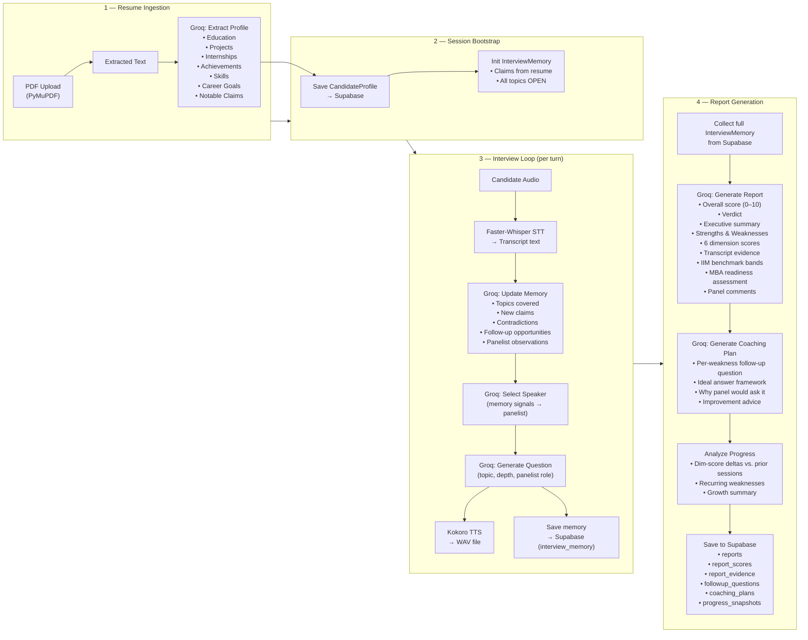
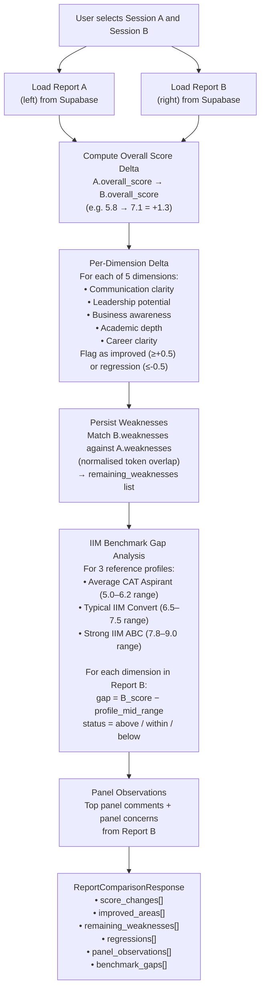
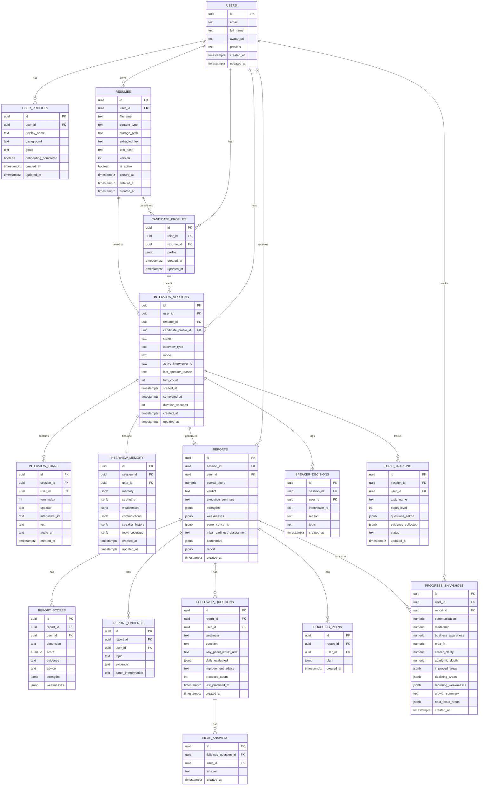

# PANELIQ — AI-Powered IIM MBA Interview Simulator

<div align="center">


**Realistic, adaptive multi-panel IIM interview simulations powered by Groq LLaMA 3.3 70B — with AI-driven question sequencing, voice synthesis, and report-based progress tracking.**

[Features](#-unique-selling-points) · [Architecture](#-high-level-architecture) · [AI Workflow](#-ai-interview-workflow) · [Database](#-database-schema) · [Setup](#-local-development-setup)

</div>

---

## 📌 Overview

PANELIQ simulates IIM MBA admissions panel interviews. A candidate uploads their resume, and three AI-driven panelists — each with a distinct evaluation focus — interrogate them using a shared memory that grows dynamically throughout the interview. The system generates a detailed scored report, coaching plan, and progress benchmarks across multiple sessions.

---

## ✨ Unique Selling Points

| USP | Description |
|-----|-------------|
| **Multi-Panel AI** | Three distinct AI interviewers (Academic, Pressure, MBA) — each with a unique interrogation lens — share a live memory of the candidate |
| **Adaptive, Non-Sequential Questions** | Speaker selection is AI-driven based on memory signals (contradictions, follow-ups, depth gaps) — not a round-robin queue |
| **Depth Laddering** | Each topic is probed progressively through 5 depth levels (e.g., problem → architecture → decisions → tradeoffs → business impact) |
| **Smart Contradiction Detection** | Prof. Arvind Menon (Pressure panelist) is triggered automatically when conflicting claims are detected across answers |
| **Voice Interface** | Faster-Whisper transcribes candidate audio; Kokoro TTS speaks interviewer questions with distinct voice personas |
| **PDF Resume Parsing** | PyMuPDF extracts resume text; Groq LLM builds a structured candidate profile for grounding all questions |
| **Scored Evaluation Report** | Multi-dimensional scoring across Communication, Leadership, Business Awareness, Academic Depth, Career Clarity with IIM benchmark comparison |
| **Cross-Session Progress Tracking** | Dimension score deltas, recurring weakness detection, and trend analysis across all past interviews |
| **Session Report Comparison** | Side-by-side comparison of two sessions with benchmark gap analysis (Average CAT Aspirant → Strong IIM ABC Candidate) |
| **Coaching Plans** | AI-generated follow-up questions, ideal answer frameworks, and practice tracking per weakness |

---

## 🛠 Technology Stack

### Backend

| Layer | Technology | Purpose |
|-------|-----------|---------|
| **API Framework** | [FastAPI 0.115](https://fastapi.tiangolo.com/) | REST API, request validation, dependency injection |
| **Runtime** | [Uvicorn 0.34](https://www.uvicorn.org/) | ASGI server |
| **Data Validation** | [Pydantic 2.10](https://docs.pydantic.dev/) | Request/response schemas, domain models |
| **AI Inference** | [Groq SDK 0.13 + LLaMA 3.3 70B](https://groq.com/) | Question generation, memory updates, report synthesis |
| **LLM Orchestration** | [LangGraph 0.2](https://www.langchain.com/langgraph) | Agentic state management |
| **Speech-to-Text** | [Faster-Whisper 1.1](https://github.com/SYSTRAN/faster-whisper) | Candidate audio transcription |
| **Text-to-Speech** | [Kokoro 0.9](https://github.com/hexgrad/kokoro) | Interviewer voice synthesis (3 distinct voices) |
| **PDF Parsing** | [PyMuPDF 1.25](https://pymupdf.readthedocs.io/) | Resume text extraction |
| **Database Client** | [supabase-py 2.10](https://github.com/supabase-community/supabase-py) | Supabase REST + Auth integration |
| **Environment** | [python-dotenv](https://github.com/theskumar/python-dotenv) | `.env` loading |

### Frontend

| Layer | Technology | Purpose |
|-------|-----------|---------|
| **Framework** | [Next.js 16](https://nextjs.org/) + [React 19](https://react.dev/) | UI rendering, SSR, routing |
| **Language** | [TypeScript 5.7](https://www.typescriptlang.org/) | Type-safe frontend code |
| **Styling** | [Tailwind CSS 3.4](https://tailwindcss.com/) | Utility-first CSS |
| **Charts** | [Recharts 3.8](https://recharts.org/) | Score trend charts, dimension radar |
| **Icons** | [Lucide React 0.468](https://lucide.dev/) | UI icons |
| **Auth** | [@supabase/supabase-js 2.107](https://supabase.com/docs/reference/javascript) | Auth, session management |
| **Utilities** | [clsx 2.1](https://github.com/lukeed/clsx) | Conditional class names |

### Infrastructure

| Layer | Technology | Purpose |
|-------|-----------|---------|
| **Database** | [Supabase (PostgreSQL)](https://supabase.com/) | Interview data, user profiles, reports |
| **Auth** | [Supabase Auth](https://supabase.com/auth) | JWT, OAuth providers |
| **Storage** | [Supabase Storage](https://supabase.com/storage) | Resume file storage |
| **Audio Storage** | Local filesystem (`/generated_audio/`) | Kokoro-generated `.wav` files |

---

## 📂 Project Structure

```
paneliq/
├── backend/
│   ├── app/
│   │   ├── __init__.py          # Package marker
│   │   ├── main.py              # FastAPI app, all REST endpoints, PDF renderer
│   │   ├── orchestrator.py      # Session lifecycle: create → start → turn → end → report
│   │   ├── intelligence.py      # Core AI engine: profile parsing, question generation, memory, report, coaching
│   │   ├── models.py            # Pydantic domain models (all request/response/memory shapes)
│   │   ├── database.py          # Supabase repository: CRUD for sessions, memory, reports, progress
│   │   ├── interviewers.py      # Panelist definitions (Academic, Pressure, MBA)
│   │   ├── voice.py             # Faster-Whisper (STT) + Kokoro (TTS) voice services
│   │   ├── resume.py            # PyMuPDF resume text extraction
│   │   └── demo.py              # Demo-mode seeded data
│   ├── generated_audio/         # Kokoro TTS output (.wav files, served via /audio)
│   └── requirements.txt
│
├── frontend/
│   ├── app/
│   │   ├── layout.tsx           # Root HTML layout, Google Fonts, metadata
│   │   ├── page.tsx             # Single-page application (onboarding → interview → report)
│   │   └── globals.css          # Design system tokens, Tailwind layers
│   ├── components/
│   │   ├── InterviewRoom.tsx    # Real-time interview UI: audio recording, subtitle panel, turn flow
│   │   ├── InterviewerCard.tsx  # Panelist avatar with active state
│   │   ├── CandidateCamera.tsx  # Webcam feed with live status overlay
│   │   ├── ScoreChart.tsx       # Recharts radar/bar score visualisation
│   │   ├── ScoreBadge.tsx       # Coloured score badge component
│   │   ├── BenchmarkTable.tsx   # IIM benchmark comparison table
│   │   ├── DimensionGrid.tsx    # Dimension score grid with evidence
│   │   ├── CoachingCard.tsx     # Coaching item with follow-up question and ideal answer
│   │   ├── ReportDownloadButton.tsx  # PDF report download trigger
│   │   ├── SessionTimer.tsx     # 25-minute countdown timer
│   │   └── SubtitlePanel.tsx    # Live subtitle text display
│   ├── lib/                     # API client, Supabase client utilities
│   ├── package.json
│   ├── tailwind.config.ts
│   └── tsconfig.json
│
├── supabase/
│   ├── schema.sql               # Full PostgreSQL schema (16 tables)
│   ├── seed_demo_account.sql    # Demo user seed data
│   └── migrations/              # Version-controlled schema migrations
│
├── tests/                       # Test suite
├── docs/                        # Additional documentation
├── .env                         # Root environment variables (shared backend)
└── README.md
```

---

## 🏗 High-Level Architecture



---

## 🤖 AI Interview Workflow

### How Questions Are Asked — Non-Sequential, Memory-Driven

PANELIQ does **not** follow a fixed question script. Every question is determined dynamically based on the shared interview memory, candidate answers, and panelist-specific signals.



### Topic Depth Ladder System

Each topic follows a 5-level depth ladder. PANELIQ tracks the current depth level per topic and always pushes to the next level:

| Level | Projects | Academics | Internships | Leadership | Career Goals |
|-------|----------|-----------|-------------|------------|--------------|
| 1 | Problem | Conceptual foundation | Role scope | Situation | Target role |
| 2 | Architecture | Application | Ownership | People challenge | Reasoning |
| 3 | Technical decisions | Edge cases | Decisions | Decision | Skills gap |
| 4 | Tradeoffs | Tradeoffs | Stakeholder tradeoffs | Conflict or tradeoff | Market understanding |
| 5 | Business impact | Business relevance | Measured impact | Learning | Long-term coherence |

### Panelist Roles & Specializations

| Panelist | Name | Triggers | Topics Owned |
|----------|------|----------|-------------|
| **Academic** (Dr. Meera Rao) | Always opens the interview | Academics, Projects, Internships, Skills |
| **Pressure** (Prof. Arvind Menon) | Contradiction detected, vague claims, short answers | Strengths, Weaknesses, Current Affairs, Contradictions |
| **MBA** (Ananya Sen) | Underrepresented, career signal, leadership gaps | Career Goals, MBA Motivation, Leadership |

---

## 📊 Full Retrieval-to-Report AI Workflow



---

## 🔄 How Past Reports Are Compared

PANELIQ's `/reports/compare` endpoint performs a structured delta analysis between any two completed sessions:



---

## 🗄 Database Schema (DBMS Diagram)



---

## 🔌 REST API Reference

| Method | Endpoint | Description |
|--------|----------|-------------|
| `GET` | `/health` | Service health + Supabase status |
| `GET` | `/interviewers` | List all 3 panelists |
| `GET` | `/me` | Authenticated user profile + active resume |
| `GET` | `/resume` | Get active resume record |
| `POST` | `/resume/upload` | Upload PDF, extract text, parse profile |
| `DELETE` | `/resume` | Delete active resume |
| `POST` | `/speech/transcribe` | Transcribe audio blob → text (Whisper) |
| `POST` | `/sessions` | Create new interview session |
| `POST` | `/sessions/{id}/start` | Start session, generate opening question |
| `POST` | `/sessions/{id}/turn` | Submit candidate answer, receive next question |
| `GET` | `/sessions/{id}/report` | Get evaluation report (JSON) |
| `GET` | `/sessions/{id}/report.pdf` | Download evaluation report (PDF) |
| `POST` | `/sessions/{id}/end` | End session early, trigger report generation |
| `DELETE` | `/sessions/{id}` | Delete incomplete session |
| `GET` | `/history` | All past interview sessions |
| `GET` | `/progress` | Dimension progress dashboard across sessions |
| `GET` | `/reports/compare?left_session_id=&right_session_id=` | Compare two reports with benchmark gap analysis |
| `POST` | `/practice/{practice_id}` | Mark a follow-up question as practiced |

---

## ⚙️ Local Development Setup

### Prerequisites

- Python 3.12+
- Node.js 20+
- A [Supabase](https://supabase.com/) project (with schema applied)
- A [Groq](https://groq.com/) API key

### 1. Clone & Configure Environment

```bash
git clone <repo-url>
cd paneliq
```

Create `.env` in the project root:

```env
# Supabase
SUPABASE_URL=https://your-project.supabase.co
SUPABASE_SERVICE_ROLE_KEY=your-service-role-key
SUPABASE_ANON_KEY=your-anon-key

# Groq
GROQ_API_KEY=gsk_...
GROQ_MODEL=llama-3.3-70b-versatile

# Voice (optional — browser TTS is used as fallback)
WHISPER_MODEL=base.en
WHISPER_DEVICE=cpu
WHISPER_COMPUTE_TYPE=int8
KOKORO_LANG=a
KOKORO_VOICE_ACADEMIC=af_sarah
KOKORO_VOICE_PRESSURE=am_adam
KOKORO_VOICE_MBA=af_nicole
```

### 2. Backend

```bash
cd backend
python -m venv .venv
source .venv/bin/activate      # Windows: .venv\Scripts\activate
pip install -r requirements.txt
uvicorn app.main:app --reload --port 8000
```

API available at `http://localhost:8000`  
Interactive docs at `http://localhost:8000/docs`

### 3. Frontend

```bash
cd frontend
npm install
```

Create `frontend/.env.local`:

```env
NEXT_PUBLIC_SUPABASE_URL=https://your-project.supabase.co
NEXT_PUBLIC_SUPABASE_ANON_KEY=your-anon-key
NEXT_PUBLIC_API_URL=http://localhost:8000
```

```bash
npm run dev
```

App available at `http://localhost:3000`

### 4. Database

Apply the schema to your Supabase project:

```bash
# Via Supabase CLI
supabase db push

# Or paste supabase/schema.sql directly into the Supabase SQL editor
```

To seed the demo account:

```bash
# In Supabase SQL editor
\i supabase/seed_demo_account.sql
```

---

## 🧠 Intelligence Module Map

| Function | What it does |
|----------|-------------|
| `create_candidate_profile()` | Groq extracts structured profile from raw resume text |
| `generate_opening_question()` | Always starts with the Academic panelist on the strongest resume item |
| `update_memory()` | Groq updates shared memory: topics, claims, weaknesses, contradictions, follow-ups |
| `select_speaker()` | Groq (or local fallback) picks next panelist based on memory signals |
| `generate_question()` | Groq generates one question for the selected panelist at the correct depth level |
| `_finalize_question()` | Validates question: no duplicates, no verbatim candidate speech, no filler |
| `generate_report()` | Groq synthesizes full evaluation report from complete transcript + memory |
| `generate_coaching_items()` | Groq generates per-weakness coaching cards with ideal answer frameworks |
| `analyze_progress()` | Delta analysis across all user reports — identifies trends and recurring issues |
| `compare_reports()` | Side-by-side dimension delta + IIM benchmark gap computation |
| `_force_silent_panelist()` | Hard rule: ensures all 3 panelists speak within the first 3 turns |

---

## 📋 Interview Completion Criteria

The interview ends when **any** of these conditions is met:

1. **Turn count ≥ 12** — full interview round completed
2. **Wall-clock ≥ 25 minutes** — time limit reached
3. **Sufficient depth** — all of these hold simultaneously:
   - ≥ 4 candidate turns
   - ≥ 4 distinct topics covered
   - ≥ 2 substantive answers (≥ 40 words each)
   - All 3 panelists have spoken at least once
4. **Candidate explicitly requests to end** (e.g., "I want to end", "wrap up")

---

## 📄 Report Structure

Each generated report contains:

| Section | Content |
|---------|---------|
| **Verdict** | Likely Convert / Borderline / Needs Improvement |
| **Overall Score** | 0–10 composite |
| **Executive Summary** | Narrative assessment anchored in transcript evidence |
| **Strengths** | Evidence-backed strengths list |
| **Weaknesses** | Evidence-backed weaknesses list |
| **Dimensions** | 6 dimension scores with evidence, advice, and per-dimension strengths/weaknesses |
| **Transcript Evidence** | Topic-wise quotes with panel interpretations |
| **IIM Benchmarks** | Score bands for 3 reference profiles across 5 dimensions |
| **MBA Readiness Assessment** | Narrative MBA fit evaluation |
| **Panel Comments** | Panel-level notes per topic coverage |
| **Coaching Plan** | Per-weakness: follow-up question, ideal answer, skills evaluated, practice advice |
| **Progress Analysis** | Cross-session delta summary (if ≥ 2 interviews completed) |

---

## 🔐 Security

- All API endpoints require a valid Supabase JWT (`Authorization: Bearer <token>`)
- Row-level security is enforced: users can only access their own sessions, reports, and resumes
- Service role key is backend-only and never exposed to the frontend
- Resume text is stored server-side; the extracted text is only served to the authenticated user who uploaded it

---

## 📜 License

MIT — see [LICENSE](LICENSE) for details.

---

<div align="center">
Built with ❤️ for serious MBA aspirants preparing for IIM, ISB, and top B-school interviews.
</div>
